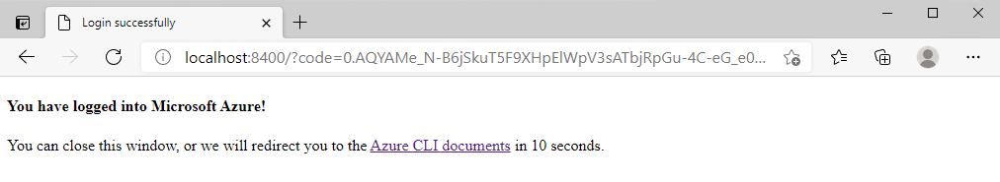
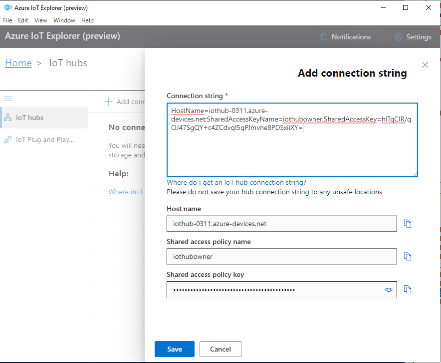

# Lab #1: Connect your Plug and Play device to Azure IoT Solution

This lab shows how to develop an IoT Plug and Play device, connect it to Azure IoT Hub and interact with your IoT Solution.

## 1. Prerequisites

- **Azure Global Subscription**

    You can use your own if you have one. If not, you may request for a free trial with $200 credit for 30 days from [here](https://azure.microsoft.com/en-us/free/).

    `Account name: xxx@xxx.onmicrosoft.com`

-  **Azure China Subscription**

    You will be provided with this.
    
    `Account name: xxx@xxx.partner.onmschina.cn`

## 2. Set up Dev Environment

Use **Azure China Account** to create a VM as the Dev environment.

### 2.1 Install Windows 10 Pro 20H2 VM on Azure

You may follow this [tutorial](https://docs.microsoft.com/en-us/azure/virtual-machines/windows/quick-create-portal) to install Windows 10 Pro 20H2 Azure VM. 

**Be noted:**
- VM Size: **D16s_v4** (16 vcpus, 64 GiB memory)

Once successfully created, download RDP file to your local PC.

Then RDP tool to login to Windows 10 VM on Azure. For example: 
- localhost\username
- Password

### 2.2 Install Azure CLI

On dev environment - Windows 10 Pro, follow this [guide](https://docs.microsoft.com/en-us/cli/azure/install-azure-cli-windows?tabs=azure-cli) to download and install Azure CLI latest version on your Dev PC. 

If you find it's slow to download from above link, you may try to download v2.20.0 from [here](https://storage0713.blob.core.chinacloudapi.cn/share/azure-cli-2.20.0.msi?sv=2020-04-08&st=2021-03-08T15%3A05%3A45Z&se=2021-04-09T15%3A05%3A00Z&sr=b&sp=r&sig=eAMyccLeuEAKHn%2FpfozU2shFVKb%2FKfpcS5bIlzgLey0%3D).

### 2.3 Install Azure-IoT extension for Azure CLI

Run below command in PowerShell to add azure-iot extension to Azure CLI

    az extension add --name azure-iot

Once installed successfully, run below command to verify.

    az --version

### 2.4 Install Azure IoT Explorer

You can download the latest release from [here](https://github.com/Azure/azure-iot-explorer/releases) on Github.

If you have problem to access Github, you may also download v0.13.6 from  [here](https://storage0713.blob.core.chinacloudapi.cn/share/Azure.IoT.Explorer.preview.0.13.6.msi?sv=2020-04-08&st=2021-03-08T15%3A12%3A51Z&se=2021-04-09T15%3A12%3A00Z&sr=b&sp=r&sig=dciszybbpBl5rhn8ikaqw8x68%2FxMuGueCi0vUOrt6gc%3D).

### 2.5 Install Visual Studio Code

Download the latest VS Code release from [here](https://code.visualstudio.com/Download).

If you find it's slow to download from above link, you may try to download v1.54.1 from [here](https://storage0713.blob.core.chinacloudapi.cn/share/VSCodeUserSetup-x64-1.54.1.exe?sv=2020-04-08&st=2021-03-08T16%3A14%3A51Z&se=2021-04-09T16%3A14%3A00Z&sr=b&sp=r&sig=wPxBKYQjJe9eTJleP6D%2FCZ%2FZPugasV8vSHMK1juz1AI%3D)

### 2.6 Install Visual Studio Community

Download Visual Studio 2019 latest release from [here](https://visualstudio.microsoft.com/downloads/).

Double click the Installer downloaded to initiate the downloading and installing.

On the installing page, follow below screenshot to configure.

Click install to start downloading and installing.

Once installed successfully, you may login with your account. If you don't have one, just click "Not now, may later" as below to start Visual Studio 2019.

Leave it there for now.

### 2.7 Install Git

Download the latest Git from [here](https://git-scm.com/download/) and install it.

## 3. Create resources on Azure

Use your Azure Global Account.

### 3.1 Login and set your Azure Subscription

#### 3.1.1 Login
Open Powershell and run below command:

    az login 

You will be prompted to sign in with your credentials on the browser.

Click Sign in.

Once logged in, the susbcription details will be displayed as below:

#### 3.1.2 Select subscription
If you have multiple susbscriptions, you may select a subscription for deployment.

    az account set -s {subscription name or id}

#### 3.1.3 Create environment variables

Below variables will be used. You may create now.

Run below script in Powershell. 

Be noted you may use **your own values** for each.

    $location="southeastasia"
    $rgName="bootcamp"
    $iothubName="iothub-0311"
    $dpsName="dps-0311"
    $enrollmentId="pnp-device"
    $iothubDeviceId="pnp-device"    

### 3.2 Create Resource Group

Run below command in Powershell.

    az group create -l $location -n $rgName    

### 3.3 Create IoT Hub

Run below command.

    az iot hub create -n $iothubName -l $location -g $rgName

### 3.4 Create a DPS Instance

Run below command to create a DPS instance.

    az iot dps create -n {dps name} -g {resource group name}

### 3.5 Link DPS instance to IoT Hub

#### 3.5.1 Get the IoT Hub connection string

Run below command on PowerShell.

    $iothubConnectionString=$(az iot hub connection-string show -n {iothub name} --key primary --query connectionString -o tsv)

#### 3.5.2 Link DPS instance to IoT Hub

    az iot dps linked-hub create --dps-name $dpsName -g $rgName -l $location --connection-string $iothubConnectionString

### 3.6 Retrieve the settings

#### 3.6.1 Show the IoT Hub Connection string

    az iot hub connection-string show -n $iothubName --key primary --query connectionString

Make a note of this **connection string**.

#### 3.6.2 Retrieve the ID scope

    az iot dps show -n $dpsName --query properties.idScope

Make a note of this **ID Scope**.

#### 3.6.3 Create a DPS device enrollment

    az iot dps enrollment create --attestation-type symmetrickey --dps-name $dpsName -g $rgName --enrollment-id $enrollmentId --device-id $iothubDeviceId --query '{registrationID:registrationId,primaryKey:attestation.symmetricKey.primaryKey}'

Make a note of the **primaryKey** and the **registrationID**.

### 3.7 Create environment variables

Create seven environment variables which will be used in latter lab to use the Device Provisioning Service (DPS) to connect to your IoT hub.

In PowerShell, run below script:

    $IOTHUB_DEVICE_SECURITY_TYPE="DPS"
    $IOTHUB_DEVICE_DPS_ID_SCOPE={IDScope}
    $IOTHUB_DEVICE_DPS_DEVICE_ID={deviceId}
    $IOTHUB_DEVICE_DPS_DEVICE_KEY={primaryKey}
    $IOTHUB_DEVICE_DPS_ENDPOINT="global.azure-devices-provisioning.net"
    $IOTHUB_CONNECTION_STRING={iothub connnection string}
    $IOTHUB_DEVICE_ID={deviceId}

### 3.8 Download the model files

Create a folder called **models** on your dev PC.

Right-click [TemperatureController.json](models/TemperatureController.json) and save the JSON file to the models folder.

Right-click [Thermostat.json](models/Thermostat.json) and save the JSON file to the models folder.

### 3.9 Configure Azure IoT explorer

The first time you run the tool, you're prompted for the **IoT hub connection string**. Use the connection string you made a note of previously.

Configure the tool to use the model files you downloaded previously. From the home page in the tool, select IoT Plug and Play Settings, then + Add > Local folder. Select the models folder you created previously. Then select Save to save the settings.

## 4. Connect your IoT Plug and Play device app to IoT Hub

### 4.1 Download the sample

Open a Command Line terminal, run below command to download the sample:

    git clone  https://github.com/Azure-Samples/azure-iot-samples-csharp.git

If you find it's slow to download from Github, you can download it from [here](https://storage0713.blob.core.chinacloudapi.cn/share/azure-iot-samples-csharp.zip?sv=2020-04-08&st=2021-03-12T06%3A15%3A26Z&se=2021-04-13T06%3A15%3A00Z&sr=b&sp=r&sig=FCgASGs4X5iazw3Ux7NaFSrh0xvTWD6UD6jlnp%2BhyWE%3D).

### 4.2 Build the code

You can now build the sample in Visual Studio and run it in debug mode.

Open the downloaded `azure-iot-samples-csharp\iot-hub\Samples\device\PnpDeviceSamples\Thermostat\Thermostat.csproj` project file in Visual Studio 2019.

In Visual Studio, navigate to `Project > Thermostat Properties > Debug`. Then add the following environment variables to the project:

Name    |	Value
--------|--------
IOTHUB_DEVICE_SECURITY_TYPE |   DPS
IOTHUB_DEVICE_DPS_ENDPOINT  |   global.azure-devices-provisioning.net
IOTHUB_DEVICE_DPS_ID_SCOPE  |	0ne0024F2E2
IOTHUB_DEVICE_DPS_DEVICE_ID |   pnp-device
IOTHUB_DEVICE_DPS_DEVICE_KEY    |   4oqAF3iLa5PoV+1T3vPE5ib7l7npzM/mRTVy14NzPjN8b+P9fmzlXJLM0q5G4sGfU8Uw2k0UvBafP37bSOF5fA==

### 4.3 Run the sample

Build the sample and run in debug mode.

### 4.4 Use Azure IoT Explorer to validate the sample code

After the device client sample starts, use the Azure IoT explorer tool to verify it's working.

- Open Azure IoT explorer.

- On the IoT hubs page, if you haven't already added a connection to your IoT hub, select + Add connection. Enter the `connection string` for the IoT hub you created previously and select `Save`.

- On the IoT Plug and Play Settings page, select `+ Add > Local folder` and select the local models folder where you saved your model files.

- On the IoT hubs page, click on the name of the hub you want to work with. You see a list of devices registered to the IoT hub.

- Click on the `Device ID` of the device you created previously.

- The menu on the left shows the different types of information available for the device.
  
    

- Select `IoT Plug and Play components` to view the model information for your device.

    

- You can view the different components of the device. The default component and any additional ones. Select a component to work with.

- Select the `Telemetry` page and then select `Start` to view the telemetry data the device is sending for this component.

    

- Select the `Properties (read-only)` page to view the read-only properties reported for this component.

    

- Select the `Properties (writable)` page to view the writable properties you can update for this component.

- Select a property by it's name, enter a new value for it, and select Update desired value.

    

    

- To see the new value show up select the `Refresh` button.

    

- Select the Commands page to view all the commands for this component. 

- Select the command you want to test set the parameter if any. Select Send command to call the command on the device. You can see your device respond to the command in the command prompt window where the sample code is running.

    

## 5. Interact with your solution

### 5.1 Configure the sample

Go to the sample downloaded in step 4.1. 

Open a new instance of Visual Studio, open `azure-iot-samples-csharp\iot-hub\Samples\service\PnpServiceSamples\Thermostat\Thermostat.csproj` project.

In Visual Studio, navigate to `Project > Thermostat Properties > Debug`. Then add the following environment variables to the project: (you should use your own values)

Name    |	Value
--------|--------
IOTHUB_DEVICE_ID |   pnp-device
IOTHUB_CONNECTION_STRING  |   HostName=iothub-0311.azure-devices.net;SharedAccessKeyName=iothubowner;SharedAccessKey=hlTqClR/qOJ47SgQY+c4ZCdvqI5qPJmvne8PDSxiiXY=

   

Now build the sample and run it in debug mode.

### 5.2 Get Devcie twin

Verify the code, you can find the code snippets to retrieve model ID info from here.

   

From the generated output, you may find the Device twin info.

   

### 5.3 Invoke a command

Below code snippet show how to invoke a command.

   

Run the sample, you will see Command getMaxMinReport was invoked.

   

**< The END of Lab #1 >**