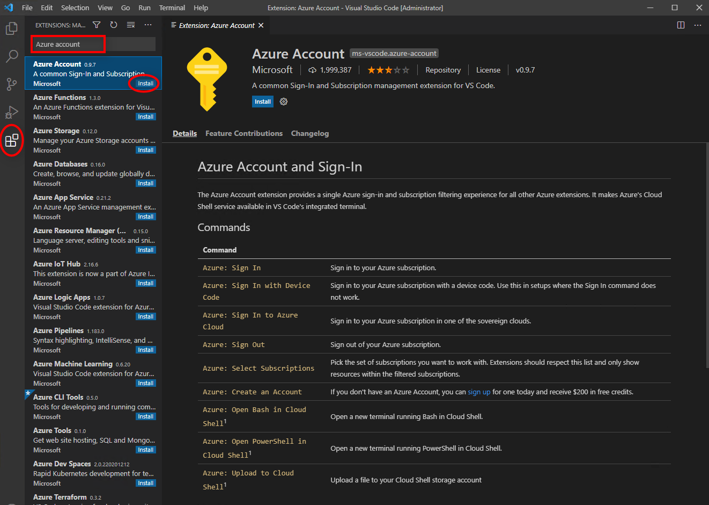
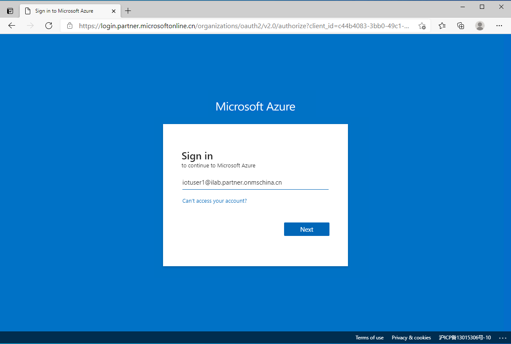
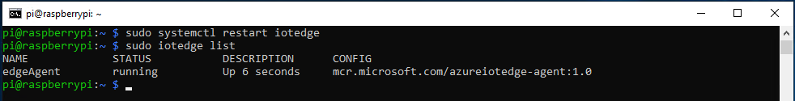
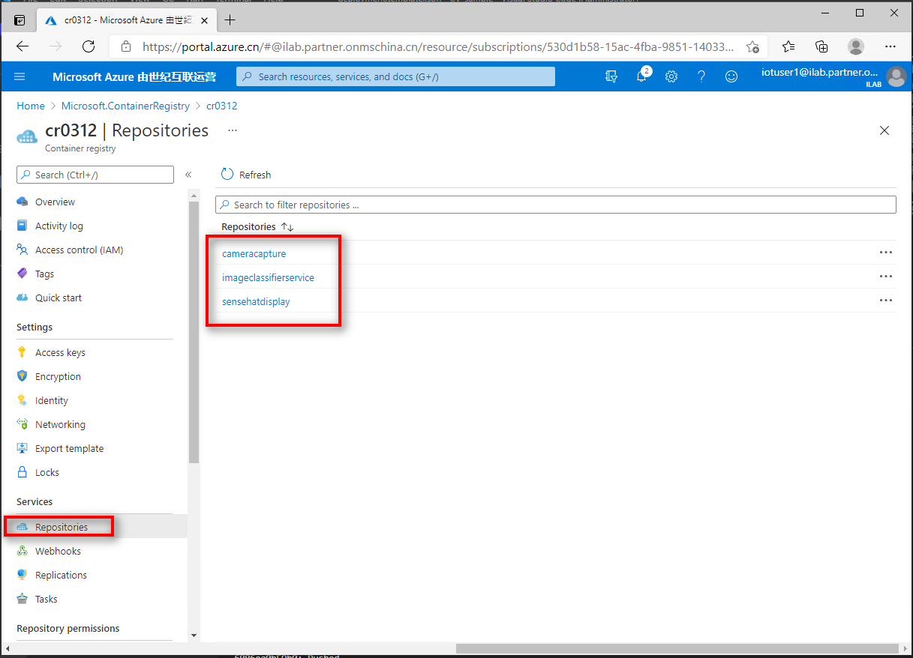

# Lab #2: Custom Vision AI + Azure IoT Edge on Raspberry Pi 4 

This lab shows how to deploy a Custom Vision model to a Raspberry Pi 4 device running Azure IoT Edge. 

Custom Vision is an image classifier that is trained in the cloud with your own images. Azure IoT Edge gives you the possibility to run this model next to your cameras, where the video data is being generated. 

## 1. Prerequisites

### 1.1 Hardware
Below hardware are required.
- **Laptop with Windows 10**
- **Raspberry Pi 4 Dev Kit** 
- **Sensehat Display**
- **USB Camera**
- **Mouse and keyboard** (optional, to be shared)
- **Video Capture card** (optional, to be shared)

### 1.2 Services
Below services are required to run this lab.
- **Azure IoT Hub**: This is your Cloud gateway which is needed to manage your IoT Edge devices. All deployments to Edge devices are made through an IoT Hub. You can use the free sku for this sample.
- **Azure Container Registry**: This is where you host your containers (e.g. IoT Edge modules). Deployment manifests refer to this container registry for the IoT Edge devices to download their images.You can use the free sku for this sample.

### 1.3 Tools
Below tools are needed.

**Set up Dev Environment on Azure:**
- **Azure China Account**:
  - If you don't have one, get from the lab owner.
- **Windows 10 Pro**: to be created on Azure 
- **Docker Desktop**: to be installed on Windows VM
- **Visual Studio Code**: to be installed on Windows VM
- **Visual Studio Code: Azure IoT Extension**:to be installed on Windows VM

## 3. Set up Dev Environment

### 3.1 Install Windows 10 Pro 20H2 VM on Azure

You may follow below guide to install Windows 10 Pro 20H2. 

Size: **D16s_v4** (16 vcpus, 64 GiB memory)

https://docs.microsoft.com/en-us/azure/virtual-machines/windows/quick-create-portal

Download RDP file to your local PC.

Then RDP to Windows 10 VM on Azure. For example: 
- localhost\username
- Password

### 3.2 Install Docker Desktop

- Open Edge Browser and enter: https://desktop.docker.com/win/stable/Docker%20Desktop%20Installer.exe to download **Docker Desktop Installer** v3.1.0(51484).
- Double click to install.
- You may be prompted to install WSL2 Kernel. 
    
    
  Click the [link](https://aka.ms/wsl2kernel), download WSL2 Linux kernel update package and install it. 
    
    
- Restart Docker once successfully and you will see Docker Desktop is running.
    

### 3.3 Install Visual Studio Code

- Download VS Code Windows 64-bit from [here](https://az764295.vo.msecnd.net/stable/622cb03f7e070a9670c94bae1a45d78d7181fbd4/VSCodeUserSetup-x64-1.53.2.exe).

### 3.4 Install extensions for VS Code
Below extensions are needed.
- Azure Account
- Azure IoT Tools
Search from extensions and install them.

    
    
    

## 4. Set up target device environment

### 4.1 Set up Labists Starter Kit and SenseHat
Insert the SD card, connect one cable, plug in the power adapater.

**Be noted**: Don't install the fan and the case.

Once installed, it will look like this:

### 4.2 Connect Devices

If you have a monitor, you don't need to use the Video Capture Card. If not,
connect your Raspberry PI 4 to your laptop's USB port using the **Video Capture card**.

Follow below picture to connect the device.

### 4.3 Configure Raspberry Pi 4

- Switch the button to ON.  

- Run `Camera app` from your local PC. `Switch camera` if you don't see the Raspberry OS screen.

  
  
- Make a note of the `IP address` of your Raspberry Pi.
- Click `Next` on `Set Country` screen.

  
  
- Click `Next` on `Change Password` screen. Don't change it. Just click `Next`.
  - Default username: pi
  - Default password: raspberry
 
  
    
- Click `Next` on `Set Up Screen` screen.

  
    
- Click `Skip` on `Select WiFI Network`screen.

  
    
- Click `Skip` on `Update Software` screen.

  
    
- Click `Later` on `Setup Complete` screen, or you may leave it there to restart later.
  

- Click `Raspberry Pi icon > Preferences > Raspberry Pi Configuration`.
  
  
  
  
    
- CLick `Interfaces > Enable SSH, SPI, I2C`.
  
  
  
- Click OK and then Yes on `Reboot needed` screen.
  
  
    
- Unplug the `keyboard, mouse, video capture card`, keep the `ethernet cable, power cord` connected. Share them to others to configure.
  
### 4.4 Install Azure IoT Edge Runtime on Raspberry Pi 4

#### 4.4.1 SSH into Raspberry Pi

Open a Command Line from your local PC, run below command:

    ssh pi@{ip address of your Raspberry Pi}

Enter the password to login.

  

#### 4.4.2 Prepare device to access Micirosoft installation packages

- Install the respository configuration for Raspberry Pi
  
    `curl https://packages.microsoft.com/config/debian/stretch/multiarch/prod.list > ./microsoft-prod.list`

- Copy the generated slist to the sources.list.d directory
  
    `sudo cp ./microsoft-prod.list /etc/apt/sources.list.d/`

- Install the Microsoft GPG public key
  
    `curl https://packages.microsoft.com/keys/microsoft.asc | gpg --dearmor > microsoft.gpg`

    `sudo cp ./microsoft.gpg /etc/apt/trusted.gpg.d/`

    

#### 4.4.3 Install a container engine

- Udate package list on the device.

    `sudo apt-get update`

- If you find it's slow to update, you may modify the source list using mirror server in China.

    

    then try to run update again.

- Install Moby engine.
    
    `sudo apt-get install moby-engine`

    

#### 4.4.4 Install IoT Edge

- Update package lists.
  
   `sudo apt-get update`

- Install IoT Edge

    `sudo apt-get install iotedge`

    

Leave it open for now. 

## 5. Deploy a sample module to Raspberry Pi 4

Follow this [tutorial](https://docs.microsoft.com/en-us/azure/iot-edge/quickstart-linux?view=iotedge-2018-06) to deploy a samle module to RPi4.

### 5.1 Login to Azure VM

- Use RDP to login to Windows 10 Pro VM created in Lab1.
- Open Edge Browser, go to [Azure China Portal](https://portal.azure.cn).
- Enter the account name. 
    
- Once logged in, you will see this:
     

### 5.2 Create an IoT Hub

On home page, click `+ Create a resource`, enter `IoT Hub` in search box, Select `IoT Hub` > `Create`, enter values like below:

 

Click `Create`. 

 

Click `Go to resource` when the deployment is complete.

### 5.3 Create an IoT Edge device

On IoT Hub page, navigage to `Automatic Device Management > IoT Edge`, click `+ Add an IoT Edge device`, enter `device ID`, and click `Save`.

 

Once created, click `Refresh` and you will see the device Id you created. 

 

Click the `device ID` to open the `Device ID` details. Make a note of the `Connection String`.

 

### 5.4 Configure IoT Edge Runtime

Go to your laptop, SSH into Raspberry Pi, run below command.

    sudo nano /etc/iotedge/config.yaml

 

Scroll down to `provisioning:` section and replace the value of `device_connection_string` with the one your made note earlier.

 

Save and Exit.

Run below command to restart the service to inititate the module sync-up.

    sudo systemctl restart iotedge
    sudo iotedge list

 

### 5.5 Set module for the device (optional)
**Be noted**:
This part is designed to validate your environment. You may skip it.

Go back to the `Azure Portal > Home > IoT Hub > IoT Edge` page, as below:

Navigate `Set modules > IoT Edge Modules > + Add > IoT Edge Module`, enter the follwing:

Name    |	Value
--------|--------
IoT Edge Module Name |   SimulatedTemperatureSensor
Image URI   |   mcr.microsoft.com/azureiotedge-simulated-temperature-sensor:1.0
Restart Policy  |   always
Desired Status  |   running
Image Pull Policy   |   On create
Startup Order   |   200

Click `Add > Next: Routes >`. Delete the default route and add new route as below:

Name    |	Value
--------|--------
SimulatedTemperatureSensorToIoTHub |   FROM /messages/modules/SimulatedTemperatureSensor/* INTO $upstream

Click `Review + create` and then click `Create` to set module.

CLick `Refresh` to view the configuration as below.

### 5.6 View result
It make a few minutes for the device to pull down the containers.

Go to Raspberry Pi, list the modules:
    sudo iotedge list

Go to Azure Portal, refresh `Edge > Modules` and you will `Reported by Device` status changed to `Yes`.

## 6. Deploy Custom Vision AI modules

### 6.1 Create Azure Container Registry
Go to Azure Portal https://portal.azure.cn. Click `+ Create a resource`, then search `Container Registry` from Marketplace, click `Create`.

Name    |	Value
--------|--------
Resource group |   use your existing RG
Registry name   |  create your own
Location    |   China East 2
SKU |   Standard

Click `Review + Create > Create`.

Once it is successfully created, Click `Go to resource > Settings > Access keys > Admin user: Enabled`. 

Make a note down below info for next steps.

    Registry name: {your ACR name} 
    Login server: {your ACR name}.azurecr.cn
    Username: {your ACR name}
    Password: {key}

### 6.2 Download the sample to Dev Environment

Download the [CV_sample.zip](https://storage0713.blob.core.chinacloudapi.cn/share/CV_sample.zip?sv=2020-04-08&st=2021-03-13T08%3A11%3A02Z&se=2021-04-14T08%3A11%3A00Z&sr=b&sp=r&sig=XbhbFVmzuPNTmRJ9%2BTGHYf0JwoAJEo4sQlykNlZUBXc%3D) to the Dev environment.

### 6.3 Update the .env file
Unzip `sample.zip` and open it in `Visual Studio Code`.

Replace the value of these variables with your own container registry.

    CONTAINER_REGISTRY_ADDRESS="Your ACR login server"
    CONTAINER_REGISTRY_USERNAME="Your ACR username"
    CONTAINER_REGISTRY_PASSWORD="Your ACR password"

### 6.4 Sign in to Azure China
Press `Ctrl + Shift + P`, enter `Azure: Sign in Azure Cloud`, Select `Azure China`, pick your account to complete the sign in.

### 6.5 Select IoT Hub
Click `Select IoT Hub` from Azure IoT Hub panel > `Select Subscriptioin` > `Select IoT Hub`, you will see the Azure IoT Hub and Devices and Modules info listed.

### 7.6 Login to ACR
Login to `Azure container registry` by running below command from `Terminal` window.

    docker login -u <ACR username> -p <ACR password> <ACR login server>

You will be promted "Login Succeeded".

#### 6.7 Build and Push IoT Edge Soution

Right click on `deployment.template.json`, and select `Build and push IoT Edge Solution`. 

It may take a while if this is the first time.

Once successfully built and pushed, you will be able to see the uploaded images on ACR. 

Go to view them at Azure Portal -> `Container Registry -> Services -> Respositories`.

### 6.8 Deploy the solution to Raspberry Pi

In Visual Studio Code, click `config`, right click `deployment.json`, select `Create deployment for single device`, select `your edge device`, you will see `[Edge] Depoyment succeeded` from `Output window`.

Click `Refresh` button on `Modules`.

List on the device:

## 7. Test the module

Open the camera from brower.

    http://yourDeviceIP:5012

Find some pictures of banana and orange from the web or use below picture to test.

0

< THE END of Lab#2 >

